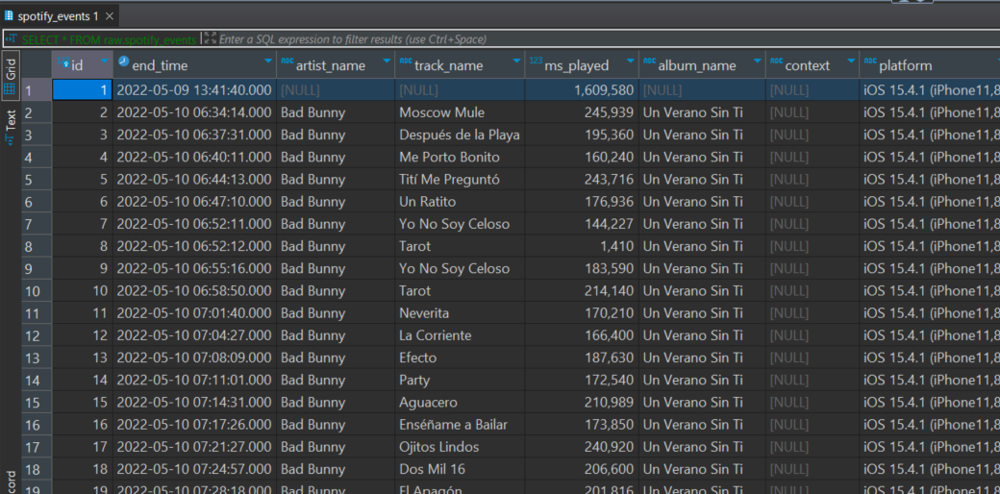
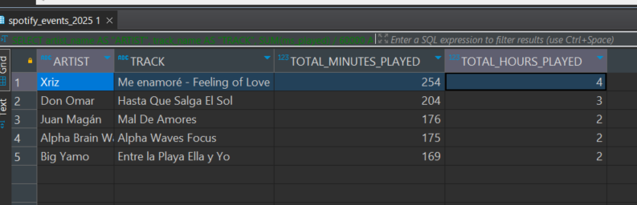
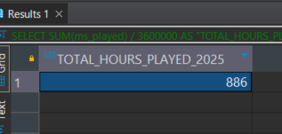
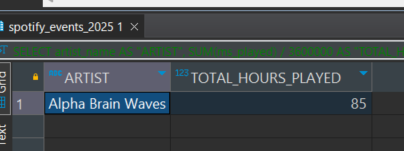
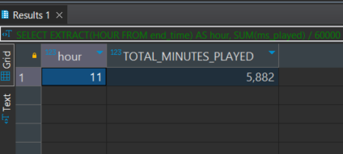
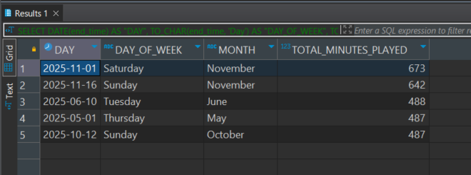
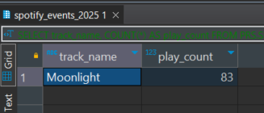
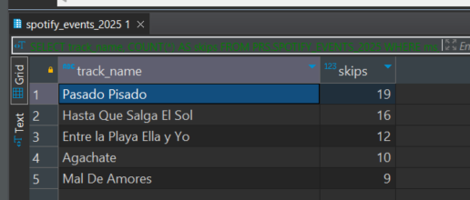

# spotify-wrapper2025

Spotify Wrapped 2025 - Personal Analytics

This project allows you to generate a Spotify Wrapped-style analysis for 2025 using your own Spotify streaming history. It uses PostgreSQL for data storage and Python for loading JSON data into a structured database.

```
spotify-wrapper2025/
├── README.md
├── SAMPLE_DATA.json
├── Spotify Extended Streaming History/ 
├── SQLs/
│   └── DDLs/
    └── Queries/                           
├── src/
│   └── load_json_to_dataframe.py        
├── venv/                               
└── requirements.txt
└── .env/                    
```

### Setup Instructions

Create your PostgreSQL database
Make sure PostgreSQL is installed and running.

```
DB_NAME=postgres
DB_USER=postgres
DB_PASSWORD= your_password
DB_HOST= your_local_host
DB_PORT=5433 # In my case 5433 but you can change it
```

You can check your database with:
```sql
SELECT current_database();

CREATE SCHEMA RAW; --

-- PRS schema: processed / filtered data
CREATE SCHEMA PRS;

-- =========================
-- RAW DATA TABLE
-- =========================
-- This table stores all raw Spotify events with detailed metadata
CREATE TABLE RAW.SPOTIFY_EVENTS (
    id SERIAL PRIMARY KEY,
    end_time TIMESTAMP NOT NULL,
    artist_name TEXT,
    track_name TEXT,
    ms_played INTEGER NOT NULL,
    album_name TEXT,
    context TEXT,
    platform TEXT,
    user_id TEXT,
    conn_country TEXT,
    ip_addr TEXT,
    spotify_track_uri TEXT,
    episode_name TEXT,
    episode_show_name TEXT,
    spotify_episode_uri TEXT,
    audiobook_title TEXT,
    audiobook_uri TEXT,
    audiobook_chapter_uri TEXT,
    audiobook_chapter_title TEXT,
    reason_start TEXT,
    reason_end TEXT,
    shuffle BOOLEAN,
    skipped BOOLEAN,
    offline BOOLEAN,
    offline_timestamp TEXT,
    incognito_mode BOOLEAN
);

-- =========================
-- PROCESSED 2025 DATA TABLE
-- =========================
-- This table stores only 2025 data and only relevant columns for analysis

CREATE TABLE PRS.SPOTIFY_EVENTS_2025 (
    id SERIAL PRIMARY KEY,
    end_time TIMESTAMP NOT NULL,
    artist_name TEXT,
    track_name TEXT,
    ms_played INTEGER
);
```

### Add your Spotify JSON data
Place your exported Spotify streaming history JSON files into:

Spotify Extended Streaming History/


Example files:

Streaming_History_Audio_2025_2.json
Streaming_History_Audio_2022-2024_0.json
Streaming_History_Video_2024-2025.json
Streaming_History_Audio_2024-2025_1.json


### Set up Python environment

```bash
python -m venv venv
source venv/bin/activate       # Linux/macOS
venv\Scripts\activate          # Windows
pip install -r requirements.txt
```

### Load JSON data into PostgreSQL
```bash
python src/load_json_to_dataframe.py
```

### Check your raw data
```sql
SELECT * FROM RAW.SPOTIFY_EVENTS;
```



### Populate 2025 processed table
```sql
INSERT INTO PRS.SPOTIFY_EVENTS_2025 (end_time, artist_name, track_name, ms_played)
SELECT
    end_time,
    artist_name,
    track_name,
    ms_played
FROM RAW.SPOTIFY_EVENTS
WHERE end_time >= '2025-01-01'
AND artist_name IS NOT NULL;

-- Check data has been loaded in SPOTIFY_EVENTS_2025

SELECT * FROM PRS.SPOTIFY_EVENTS_2025

```


### Example Queries

Fun part finally! Let's discover

## Top 5 Tracks by Listening Time

```sql
SELECT
    artist_name AS "ARTIST",
    track_name AS "TRACK",
    SUM(ms_played)/60000 AS "TOTAL_MINUTES_PLAYED",
    SUM(ms_played)/3600000 AS "TOTAL_HOURS_PLAYED"
FROM PRS.SPOTIFY_EVENTS_2025
GROUP BY artist_name, track_name
ORDER BY "TOTAL_MINUTES_PLAYED" DESC
LIMIT 5;
```


## Total Hours Listened in 2025

```sql
SELECT
    SUM(ms_played)/3600000 AS "TOTAL_HOURS_PLAYED_2025"
FROM PRS.SPOTIFY_EVENTS_2025;
```



## Top Artist by Hours
```sql
SELECT
    artist_name AS "ARTIST",
    SUM(ms_played)/3600000 AS "TOTAL_HOURS_PLAYED"
FROM PRS.SPOTIFY_EVENTS_2025
GROUP BY artist_name
ORDER BY "TOTAL_HOURS_PLAYED" DESC
LIMIT 1;
```


## Most Active Listening Hour

```sql
SELECT
    EXTRACT(HOUR FROM end_time) AS hour,
    SUM(ms_played)/60000 AS "TOTAL_MINUTES_PLAYED"
FROM PRS.SPOTIFY_EVENTS_2025
GROUP BY hour
ORDER BY "TOTAL_MINUTES_PLAYED" DESC
LIMIT 1;
```


## TOP DAYS BY MINUTES LISTENED

```sql
SELECT
    DATE(end_time) AS "DAY",
    TO_CHAR(end_time, 'Day') AS "DAY_OF_WEEK",
    TO_CHAR(end_time, 'Month') AS "MONTH",
    SUM(ms_played) / 60000 AS "TOTAL_MINUTES_PLAYED"
FROM PRS.SPOTIFY_EVENTS_2025
GROUP BY DATE(end_time), TO_CHAR(end_time, 'Day'), TO_CHAR(end_time, 'Month') 
ORDER BY "TOTAL_MINUTES_PLAYED" DESC
LIMIT 5;
```



## Listening Periods

```sql
SELECT CASE 
         WHEN EXTRACT(HOUR FROM end_time) BETWEEN 5 AND 11 THEN 'Morning'
         WHEN EXTRACT(HOUR FROM end_time) BETWEEN 12 AND 17 THEN 'Afternoon'
         WHEN EXTRACT(HOUR FROM end_time) BETWEEN 18 AND 22 THEN 'Evening'
         ELSE 'Night'
       END AS period,
       SUM(ms_played)/60000 AS "TOTAL_MINUTES_PLAYED"
FROM PRS.SPOTIFY_EVENTS_2025
GROUP BY period
ORDER BY "TOTAL_MINUTES_PLAYED" DESC;
```


## Most Played Track

```sql
SELECT
    track_name,
    COUNT(*) AS play_count
FROM PRS.SPOTIFY_EVENTS_2025
GROUP BY track_name
ORDER BY play_count DESC
LIMIT 1;
```



## Most Skipped Tracks

```sql
SELECT
    track_name,
    COUNT(*) AS skips
FROM PRS.SPOTIFY_EVENTS_2025
WHERE ms_played < 5000
GROUP BY track_name
ORDER BY skips DESC;
```
